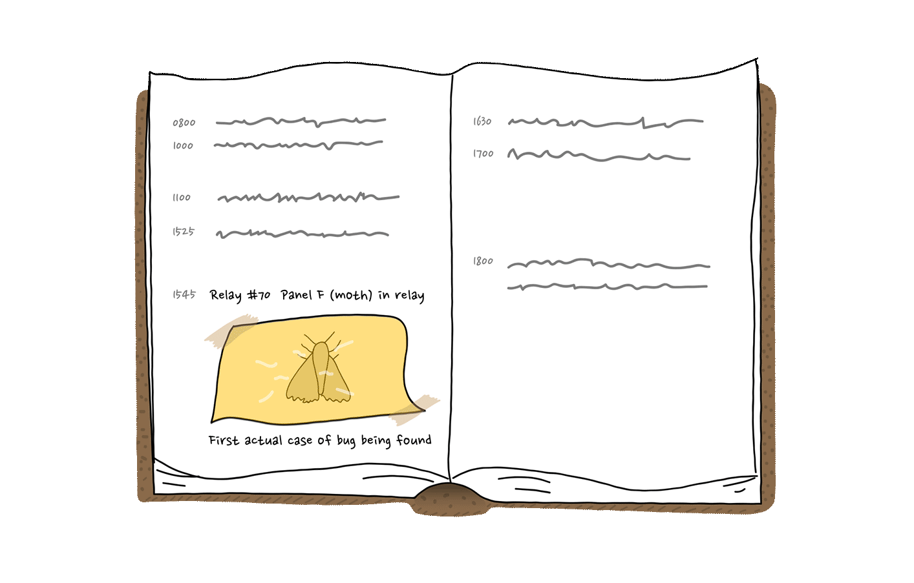

link to lesson

https://www.codecademy.com/courses/learn-python-3/lessons/python-errors/exercises/introduction-to-bugs

link to folder

/c/Users/glads/Downloads/LEARN-PYTHON3/ERRORS-IN-PYTHON/ERRORS-IN-PYTHON-Introduction-to-Bugs

ERRORS IN PYTHON
Introduction to Bugs
2 min
“First actual case of bug being found.“

The story goes that on September 9th, 1947, computer scientist Grace Hopper found a moth in the Harvard Mark II computer’s logbook and reported the world’s first literal computer bug. However, the term “bug,” in the sense of technical error, dates back at least to 1878 and with Thomas Edison.

Python refers to the mistakes within the program as errors and will point to the location where an error occurred with a ^ character. When programs throw errors that we didn’t expect to encounter, we call those errors bugs. Programmers call the process of updating the program so that it no longer produces bugs debugging.

During your programming journey, you are destined to encounter innumerable red errors. Some even say that 75% of development time is spent on debugging. But what makes a programmer successful isn’t avoiding errors, it’s knowing how to solve them. And a good place to start is understanding what they are.

In Python, there are many different ways of classifying errors, but here are some common ones:

SyntaxError: Error caused by not following the proper structure (syntax) of the language.
NameError: Errors reported when the interpreter detects a variable that is unknown.
TypeError: Errors thrown when an operation is applied to an object of an inappropriate type.
In this mini-lesson, we will be looking at these different error messages, and you’ll get some practice by debugging them one by one!

Instructions
Click Next to continue.

Concept Review
Want to quickly review some of the concepts you’ve been learning? Take a look at this material's cheatsheet!
Community Forums
Still have questions? View this exercise's thread in the Codecademy Forums.

